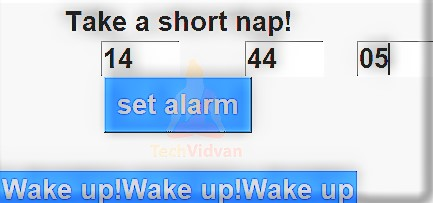

# created by Rutvik Gondaliya

## alarm-clock-python-code

### Create an Alarm Clock in Python with GUI
There is no other way to learn something than to implement it practically. So we are here with another interesting project on python.

This time, you will learn how to create a simple alarm clock with python and Tkinter.

Python alarm clock is a gui application, which can be used on a computer to set an alarm. Although it’s a simple project for beginners, but it’s interesting to implement various functionalities.

### Prerequisites
The prerequisites are: basic concepts of Python and Tkinter

To install the libraries, you can use pip installer from the cmd/Terminal:

---> pip install tkinter

### Functions Used
1. Setalarm: It sets an alarm by calling alarmClock method by passing the alarm time as argument(if the user has entered a correct and non-empty time).

2. alarmclock: This is the most important method because it performs the following tasks:

a. It stores the current time in time_now in specified format (“%H:%M:%S”)

b. It also checks if current time matches the alarm time. As soon as time matches it displays a wake-up message and plays the alarm song using pygame and mixer. And if doesn’t match the time_now it continues step b after sleeping for one second.

### Variables Used:
1. root: the main GUI window.

2. Hrs, Mins, Secs: They are tkinter string variables that store the hour’s, minute’s and second’s value entered by the user before setting an alarm.

3. Greet: It is a label to display the message” Take a short nap!”.

4. We also have hrbtn, minbtn , secbtn to take respective values from the user.

### Python Alarm Clock Project Output

